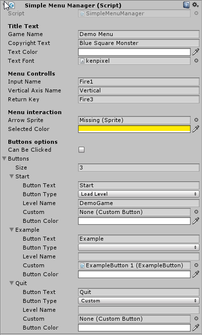

# Simple Menu Manager

This is an asset in development for having a pre made main menu, fully customizable, which allows to load scenes, change the font, color and text of every text and the action it does.

### Title Text

- Game name: The name showed on the top of the menu.
- Copyright Text: The text shown at the bottom of the menu.
- Text color: The color of the menu text.
- Text Font: The font used for the text.
### Menu Controls
Here goes the inputs for using keys.
- Input Name: What button will activate the button pres.
- Vertical Axis Name: Which axis move the menu.
- Return key: Which button goes back.
###Menu interaction
- Arrow Sprite: If an image is selected, the menu will use an arrow for the selected option.
- Selected Color: If the is no image selected in Arrow Sprite it will use this color to highlight selection.
###Buttons options
* Can be clicked: If deselected the buttons won't react to mouse selection, and the cursor will be hidden.
* Buttons
* * Button Text: The text to show in the button.
* * Button Type: The type of button it is, which define the action.
* * Level Name: If load level was selected, it will load this level (be sure to write it right and to have that scene in the build settings).
* * Custom: A prefab with a script that inherited from SimpleMainMenu.CustomButton must be placed here.
* * Button Color: What color will this button have while it's not highlighted.
## Buttons type
There are 3 types of buttons: **Load Level, Custom or Quit**.

Load Level will simply load a new scene, Quit will execute "Application.Quit()" and Custom will call whatever is written under the method *OnClickAction()*. CustomButton has a text value *buttonText* which can be edited on click, as the example script shows:

    public class ExampleButton : SimpleMainMenu.CustomButton
    {
        int exampleInt = 0;
        public override void OnClickAction()
        {
            exampleInt++;
            buttonText.text = "Example: " + exampleInt;
        }
    }